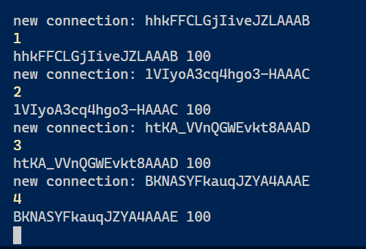

# paddle-puck-pong
This is a multiplayer pong game.

> ### I made this game while I was learning socket programming. I've used,
 - Javascript
 - p5.js
 - socket.io
 - node.js

> ### It is simple

> ### Yet I've kept scope for future developmet
